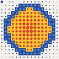
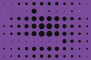
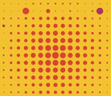
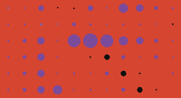
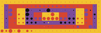
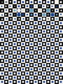
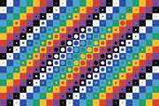
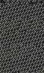

# Vonal

[](https://github.com/mrgarris0n/vonal/actions/workflows/ci.yml)

An esoteric programming language whose source form is an image.

A program is a grid of coloured geometric cells in the visual idiom of Victor
Vasarely. A cell's glyph selects an opcode, its form colour selects the variant,
and its size is both an immediate value and a writable data field. Running a
program can deform its own picture.

```
$ vonal run examples/hello.png
Hello, World!

$ echo 27 | vonal run examples/collatz-in.vsr
27 82 41 124 62 31 94 ... 8 4 2 1
```

That is the PNG being decoded and executed. The picture is the program.

## Install

Requires Python 3.11 or later.

```bash
python -m venv .venv
.venv/bin/pip install -e ".[dev]"
```

## Commands

```bash
vonal compile     src.vsr out.png     # text source to canonical image (.png only)
vonal disassemble in.png [out.vsr]    # image back to text
vonal run         plate [--max-steps N]   # accepts .vsr or .png
vonal trace       plate outdir/       # one PNG frame per step
vonal trace       plate anim.gif     # or an animated GIF (--frame-ms N)
```

## Notation

A `.vsr` file is a grid of four-character cell tokens laid out as the plate is:
`form`, `variant`, `scale`, `ground`.

A dot means the channel is zero. In the form position a dot is the void glyph
itself. `%plate WxH` is the only header, and it must match the grid.

```
%plate 3x1

o157  +1.7  ....
```

Push 5, print it, halt.

| Op | Token | Op | Token | Op | Token |
|---|---|---|---|---|---|
| push N | `o1N7` | dup | `%1.7` | gt | `D1.7` |
| push_acc N | `o2N7` | pop | `%2.7` | lt | `D2.7` |
| add | `#1.7` | swap | `%3.7` | eq | `D3.7` |
| sub | `#2.7` | over | `%4.7` | get | `@1.7` |
| mul | `#3.7` | roll | `%5.7` | put | `@2.7` |
| div | `#4.7` | turn | `v1.7` | out num | `+1.7` |
| mod | `#5.7` | turn if | `v2.7` | out char | `+2.7` |
| neg | `#6.7` | turn unless | `v3.7` | in num | `+3.7` |
| halt | `....` | | | in char | `+4.7` |

Replace `v` with `^`, `>` or `<` for the other three turn directions. `push_acc`
computes `v*8 + N`, so a row of discs spells a base-8 numeral.

The trailing `7` is the ground colour. Any value works, including 7: `ground`
is unconstrained.

The variant is not a colour. It is the figure colour's **offset** from the
ground, so the colour drawn is `(ground + variant) mod 8`. Offset 0 would paint
the figure in the ground's own colour, which is why variants run 1 to 7 and why
a figure can never match its ground: that is now an identity rather than a rule.

The consequence is worth the indirection. Rotating a cell's figure and ground
together leaves the instruction untouched, so a whole plate can be recoloured
without changing a thing it does. All eight colours can be figures, where the
old absolute encoding could only ever draw six of them and made every `push` a
black disc.

## How it runs

The eye starts at `(0,0)` heading east and advances one cell per step. The plate
is a torus, so running off any edge wraps. Headings persist until a triangle
changes them, which is the most common authoring mistake: a body row entered
from above is heading south, not east.

Two stores, with different jobs. An unbounded integer stack does the computing.
The grid's own scale channel is a bounded, writable field of 0 to 7 per cell,
readable and writable at runtime, and visible: a write re-renders that cell at a
new size.

Execution halts on a void cell.

## Composition

Two channels are free, which is what lets code and picture coexist.

`ground` has no semantics anywhere. `scale` is read only by the push family on
the cell the eye stands on, and by a `get` aimed at that cell, so on every other
cell it is free too.

`examples/vega.vsr` uses this: six cells push 5 and print it with a newline,
and the other 250 are push instructions that never execute, their sizes a
radial gradient that reads as a bulging sphere. Its ground is keyed in three
concentric bands, and the figures follow them because the variant is an offset.
The other plates do the same with whatever cells the eye never reaches. Void
padding cannot carry a composition, since a void draws nothing and must have
scale 0, so the padding is unreached push discs instead.

`examples/kinetic.vsr` goes the other way and writes the field as it runs, so
`vonal trace` on it produces frames that differ. `examples/kinetic.gif` is that
trace animated: runs of identical frames are collapsed into one held
proportionally longer, so the file stays small without the timing changing.

`examples/bubble.vsr` is the same trick doing real work. Row 7 holds eight
values as the sizes of eight discs, and the program bubble sorts that row of
the field in place, so the picture rearranges itself into a rising staircase
while it runs. `examples/bubble.gif` is the sort. Retracing it wants
`--max-steps 2000`: the plate runs 1801 steps against a `trace` default of
1000, and stopping at the cap says so rather than quietly handing you an
animation that ends mid-sort.

`examples/swell.vsr` computes its composition instead of carrying one. It
ships flat — 225 squares in rows 5 to 19, every one the same size — and the
program walks all of them and writes a radial falloff into their scales, so
the lattice inflates into a Vega-series bulge as it runs.
`examples/swell.gif` is that inflation; retracing it wants
`--max-steps 14000`. The falloff is `7 - (dx*dx + dy*dy)/14`, and it belongs
to this language twice over. `dx*dx` is never negative, so no absolute value
is needed, and an `abs` would cost a comparison, which in a grid is a
physical detour. And the corner comes to 98 with `98/14 = 7`, so the result
lands in 0 to 7 by construction — `put` rejects anything outside that range,
so a formula that cannot leave it is what lets the body run straight through
without a single branch. Every square in the field is the same instruction,
`add`. Only the ground alternates, and the figure alternates with it because
the variant is an offset: one instruction, two colours. It is the inverse of
`vega`, where the swell is authored and the program ignores it.

`examples/folklore.vsr` is what the offset encoding buys. Every cell is its
own figure and ground pair, keyed by `(x + y) mod 8`, so all eight colours
appear as grounds and all eight as figures. The figures follow the ground
diagonally because the variant is an offset, and where they break the diagonal
is where an instruction sits: you choose which channel carries the clean
pattern, and the other one records the code. It prints the sum of all 384
scales, its own loop included, so resizing any glyph moves the number.

`examples/mirror.vsr` inverts the idea. A `get` points at the swell, so those
scales stop being composition and become the program's input: it prints the
profile of its own sphere. The same pixels are decoration or data depending only
on whether anything reads them.

That is the only self-reference available. The field is built from the scale
channel alone and no opcode exposes a cell's form, variant or ground, so a
program can read its own data but never its own code.

That rules out introspection, not quines. `examples/quine.vsr` prints itself,
byte for byte:

```bash
$ vonal run examples/quine.vsr | diff - examples/quine.vsr && echo identical
identical
```

It carries no comment header, because a comment is not part of the canonical
form and no plate could reproduce one.

It works because `get` makes the data self-describing. Rows 5 to 95 are all
push discs on a black ground, so each one's token is `o1<scale>.` and the
program can print it by reading its own scale. The ground has to be uniform:
it is the one channel no opcode can read, so the printer emits that last
character from a literal and could not follow a ground that varied. Keying it
cell by cell, which is what every other plate now does, is the one thing a
quine forbids. Only rows 0 to 4, the program itself, cannot be
derived that way, so their text is encoded in those same scales as base-7
digits, three cells per character, stored as 1 to 7 so no data cell is ever a
dot. One pass decodes the header and the program, a second generates
everything below it.

Those cells are therefore read twice, once as themselves and once as digits,
which is the whole trick and also its cost: resize a disc in the overlap and
the plate stops describing itself.

## Examples

| | Plate | Output |
|---|---|---|
|  | `countdown` | `54321` |
|  | `fibonacci` | first ten terms |
|  | `collatz` | trajectory of 6 |
|  | `collatz-in` | trajectory of whatever you pipe in |
|  | `vega` | `5`, inside a swell |
|  | `hello` | `Hello, World!` |
|  | `kinetic` | nothing; it draws a staircase into its own field |
|  | `mirror` | the profile of its own swell, read back with `get` |
|  | `prime` | `1` or `0`, deciding a piped-in number |
|  | `span` | the largest of three piped-in characters, and its negation |
|  | `bubble` | `0 1 2 3 4 5 6 7`, sorted out of its own picture |
|  | `swell` | nothing; it inflates its own flat lattice into a sphere |
|  | `folklore` | `613`, the total of its own glyph sizes |
|  | `quine` | its own source, byte for byte |

```bash
.venv/bin/pytest
```

## Design

`docs/spec.md` has the full specification: the
encoding, the instruction table, error handling, and why the alternatives were
rejected.

## Licence

MIT. See `LICENSE`.
